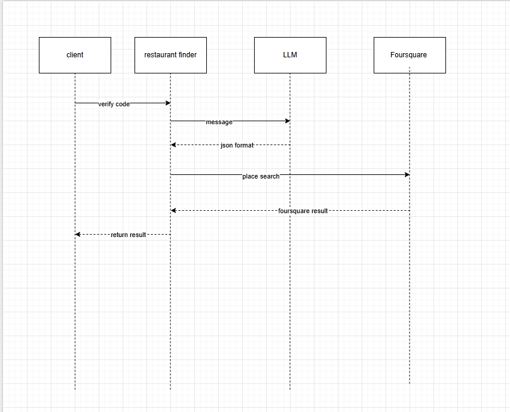

# Restaurant Finder

[](https://github.com/jeremejazz/restaurant-finder/actions/workflows/node.js.yml) 

<p align="center">

</p>

## Project setup

In the root directory, create a copy of `.env.example` to `.env`

```sh
cp .env.example .env
```

Configure `.env` file the environment variables. Be sure to provide the `GEMINI_API_KEY`, `FOURSQUARE_API_KEY`, and `CODE`.

Install dependencies

```bash
$ npm ci
```

## Compile and run the project

```bash
# development
$ npm run start

# watch mode
$ npm run start:dev

# production mode
$ npm run start:prod
```

## Run tests

```bash
# unit tests
$ npm run test

```

## API



When user/client sends a message, the message is processed by an LLM (Google Gemini) which is converted into JSON format that will be passed to the [Foursquare Places API](https://docs.foursquare.com/fsq-developers-places/reference/place-search)

### `GET` /api/execute

#### Description:

Endpoint for sending a message to send a query a list of restaurant

#### Parameters

- `code` - API Key
- `message` - message to make a request to LLM for searching restaurant. Message can be in plain sentence.

Example messages:

- Find me a cheap sushi restaurant in downtown Los Angeles that's open now and has at least a 4-star rating.
- Find me a pizza restaurant in Baguio City that's open now and has at least a 4-star rating.

### Response

Returns a JSON with list of restaurants containing the following:

- **Name**
- **Address**
- **Cuisine**
- **Rating**
- **Price Level**
- **Operating Hours**

For more information, please see the swagger docs. In the browser, add `/docs` after the base URL. (ex: https://localhost:3000/docs)
